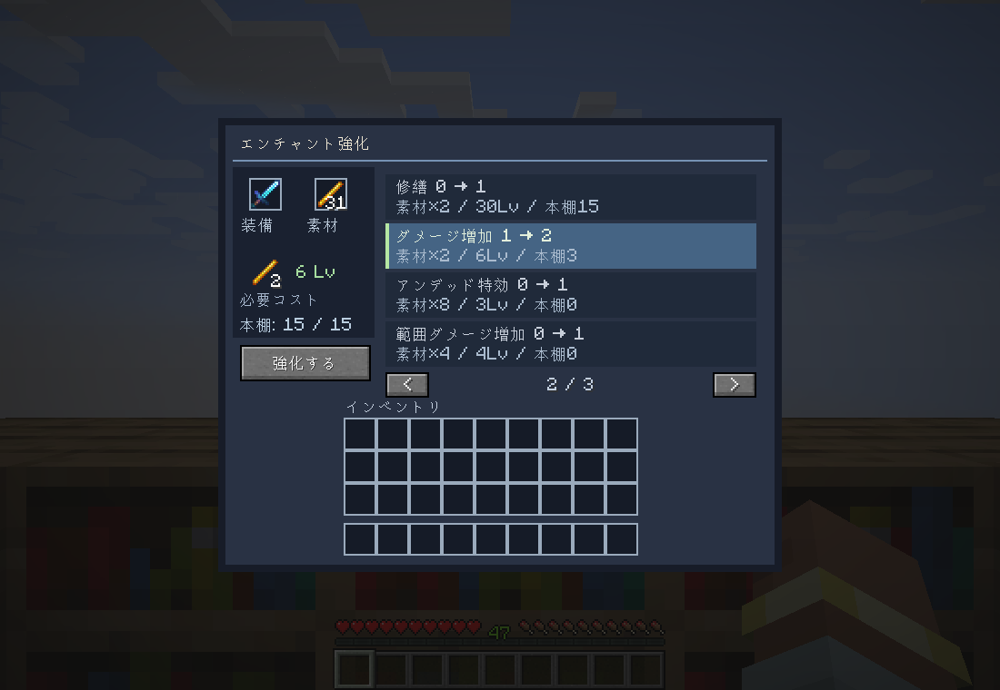

# Enchant Upgrades — エンチャント強化MOD

[English](README.en.md) · [最新版をダウンロード](https://github.com/hani2-UC/enchant-upgrades/releases/latest) · [不具合報告](https://github.com/hani2-UC/enchant-upgrades/issues)

Minecraft Java Edition **1.20.1・1.21.1・1.21.4** 用。
エンチャントテーブルのランダム抽選を、**素材＋経験値レベルで選んだ効果を1段階ずつ強化する画面**に置き換えます。
日本語・英語の画面に対応。その他の言語では画面は英語になり、Minecraft本体のアイテム名・エンチャント名は選択した言語に従います。

| Minecraft | 対応ローダー | 検証したローダー | Java |
|---|---|---|---|
| 1.20.1 | Forge / Fabric | Forge 47.4.10 / Fabric Loader 0.16.14 + Fabric API 0.92.6 | 17 |
| 1.21.1 | Fabric / NeoForge | Fabric Loader 0.16.14 + Fabric API 0.116.17 / NeoForge 21.1.252 | 21 |
| 1.21.4 | Fabric / NeoForge | Fabric Loader 0.16.14 + Fabric API 0.119.4 / NeoForge 21.4.158 | 21 |

## 導入

1. 使用するMinecraftのバージョンに合ったローダーを導入します。
2. [ダウンロードページ](https://github.com/hani2-UC/enchant-upgrades/releases/latest)から対応する `enchant_upgrades-ローダー-Minecraftバージョン-1.1.0.jar` を1個選び、使用するプロファイルの `mods` フォルダーへ入れます。
3. Fabric版では、同じMinecraftバージョンのFabric APIも入れてください。Forge・NeoForge版は外部ライブラリMOD不要です。
4. 起動してエンチャントテーブルを右クリックします。

マルチプレイではサーバーと全参加者の両方に同じMODを入れてください。

## 使い方

- 左の「装備」枠に装備または本を1個、「素材」枠に必要な素材を入れます。
- 右側の一覧から強化したい効果を選び、「強化する」を押します。
- 素材を入れると、対応するエンチャントを自動選択します。同じ素材を使う効果が複数ある場合は一覧から選べます。
- 本にも付与できます。付与済みの本や装備も、同じ画面で次のレベルへ強化できます。
- ページ移動は矢印または一覧上でのマウスホイール。Shiftクリックで装備・素材を移動できます。
- 必要素材のアイコンにカーソルを合わせると素材名が出ます。強化できない場合はボタンや効果の行に理由が出ます。
- 画面を閉じると装備と余った素材は返却されます。インベントリに入りきらない場合はドロップします。
- 装備の耐久値・名前・ほかのエンチャントは保持します。
- クリエイティブでは素材と経験値の消費を免除します。本棚・競合・最大レベルの制限は維持します。

## 初期バランス

経験値は**ポイントではなくレベル**を消費します。表の値は、その段階で支払うコストです。

| シャープネス（ダメージ増加） | ブレイズロッド | 消費レベル | 有効な本棚 |
|---|---:|---:|---:|
| 未付与 → Ⅰ | 1本 | 3 | 0 |
| Ⅰ → Ⅱ | 2本 | 6 | 3 |
| Ⅱ → Ⅲ | 3本 | 12 | 6 |
| Ⅲ → Ⅳ | 4本 | 21 | 9 |
| Ⅳ → Ⅴ | 5本 | 33 | 12 |

一般的な効果は段階的にコストが増えます。希少な効果は入手・探索の進行に合わせて高めにしています。

| 効果 | 主な素材 | 最初の素材数 | 最初の消費レベル | 最初の本棚数 |
|---|---|---:|---:|---:|
| ダメージ軽減 | 鉄インゴット | 2 | 3 | 0 |
| 火炎耐性 | マグマクリーム | 2 | 3 | 0 |
| 落下耐性 | 羽根 | 4 | 3 | 0 |
| 爆発耐性 | 火薬 | 4 | 3 | 0 |
| 飛び道具耐性 | 火打石 | 4 | 3 | 0 |
| 水中呼吸 | オウムガイの殻 | 1 | 5 | 0 |
| 水中採掘 | プリズマリンクリスタル | 4 | 6 | 3 |
| 棘の鎧 | サボテン | 4 | 6 | 0 |
| 水中歩行 | プリズマリンの欠片 | 4 | 5 | 0 |
| 氷渡り | 氷塊 | 4 | 8 | 6 |
| ソウルスピード | ソウルサンド | 4 | 8 | 6 |
| スニーク速度上昇 | 残響の欠片 | 1 | 10 | 9 |
| ダメージ増加 | ブレイズロッド | 1 | 3 | 0 |
| アンデッド特効 | 腐った肉 | 8 | 3 | 0 |
| 虫特効 | クモの目 | 2 | 3 | 0 |
| ノックバック | スライムボール | 2 | 3 | 0 |
| 火属性 | ブレイズパウダー | 4 | 6 | 3 |
| ドロップ増加 | エメラルド | 2 | 6 | 3 |
| 範囲ダメージ増加 | ネザークォーツ | 4 | 4 | 0 |
| 効率強化 | レッドストーン | 4 | 3 | 0 |
| シルクタッチ | ダイヤモンド | 2 | 18 | 9 |
| 耐久力 | アメジストの欠片 | 4 | 4 | 0 |
| 幸運 | エメラルド | 3 | 7 | 3 |
| 射撃ダメージ増加 | 火打石 | 2 | 3 | 0 |
| パンチ | スライムボール | 3 | 4 | 0 |
| フレイム | ファイヤーチャージ | 2 | 12 | 6 |
| 無限 | エンダーアイ | 2 | 24 | 12 |
| 宝釣り | プリズマリンクリスタル | 4 | 4 | 0 |
| 入れ食い | 糸 | 4 | 3 | 0 |
| 忠誠 | エンダーパール | 2 | 4 | 0 |
| 水生特効 | プリズマリンの欠片 | 4 | 3 | 0 |
| 激流 | 海洋の心 | 1 | 8 | 3 |
| 召雷 | 避雷針 | 1 | 18 | 9 |
| 拡散 | 矢 | 16 | 12 | 6 |
| 貫通 | 鉄塊 | 4 | 3 | 0 |
| 高速装填 | レッドストーン | 8 | 5 | 0 |
| 修繕 | 残響の欠片 | 2 | 30 | 15 |
| 高密度（1.21系） | 鉄インゴット | 2 | 5 | 0 |
| 防具貫通（1.21系） | ブリーズロッド | 2 | 8 | 3 |
| ウィンドバースト（1.21系） | ブリーズロッド | 4 | 20 | 12 |

呪い2種を除くバニラの37種（1.20.1）、40種（1.21系）に対応。バニラの最大レベルと両立制限を守ります。
本棚は通常のテーブルと同じ配置と、テーブルとの間の空間が必要です。Forge・NeoForgeでは本棚のエンチャントパワー、Fabricでは `minecraft:enchantment_power_provider` タグに登録された本棚を計算します。上限は15です。
村人取引・戦利品・金床・砥石の仕組みは通常どおりです。ランダム抽選の置き換え対象はテーブルです。

## コスト調整・追加MODのエンチャント対応

素材とコストは通常のデータパックで変更できます。
同じIDのJSONを下記の場所で上書きしてください。

| Minecraft | JSONの場所 | データパックの `pack_format` |
|---|---|---:|
| 1.20.1 | `data/enchant_upgrades/recipes/sharpness.json` | 15 |
| 1.21.1 | `data/enchant_upgrades/enchantment_upgrades/sharpness.json` | 48 |
| 1.21.4 | `data/enchant_upgrades/enchantment_upgrades/sharpness.json` | 61 |

1.21系では独自のデータフォルダーを使います。`type` は省略できます。範囲ダメージ増加のエンチャントIDは1.20.1の `minecraft:sweeping` から `minecraft:sweeping_edge` に変わります。

```json
{
  "type": "enchant_upgrades:upgrade",
  "enchantment": "minecraft:sharpness",
  "material": { "item": "minecraft:blaze_rod" },
  "base_material": 1,
  "material_step": 1,
  "base_levels": 3,
  "level_step": 3,
  "base_shelves": 0,
  "shelf_step": 3
}
```

目標レベルをLとすると、素材数は `base_material + material_step × (L−1)`、消費レベルは `base_levels + level_step × L × (L−1) / 2`、本棚数は `min(15, base_shelves + shelf_step × (L−1))` です。
一回の素材数は64個以下、消費レベルは32767以下である必要があります。最大スタック数が小さい素材では、それ以内の素材数を設定してください。
`material` は `{ "item": "minecraft:blaze_rod" }` または `{ "tag": "名前空間:タグ名" }` を使用できます。1.20.1では通常のIngredient配列も使用できます。
追加MODのエンチャントには、新しいレシピJSONを追加して `enchantment` にその登録IDを指定します。自動追加はしません。
`/reload` またはワールドの入り直しで適用されます。1.21系では画面を開くときにサーバーの設定を同期します。リロード前に開いていた画面は閉じられるため、テーブルを開き直してください。

## 開発

Windowsでは `./Build-Mod.ps1` で6種類をビルドして `dist/` にコピーします。`-Loader Fabric -Minecraft 1.21.4` で対象を絞り、`-Test` でゲーム内の自動テストも実行できます。JDK 17・21を用意し、`JAVA17_HOME`・`JAVA21_HOME` を設定してください。このワークスペースのローカルJDKも自動検出します。

個別のGradleプロジェクトはForgeがルート、Fabric 1.20.1が `fabric/`、Fabric 1.21系が `fabric-modern/`、NeoForgeが `neoforge/` です。1.21系では `-PmcVersion=1.21.1` または `-PmcVersion=1.21.4` を指定します。Fabric 1.21系はそのフォルダーのGradleラッパーを使います。

`runGameTestServer`（Forge・NeoForge）または `runGametest`（Fabric）で消費・競合・レベル上限・本棚・本の変換・無効な要求・返却・通信データを検証します。1.21系ではメイスと古い通信データの拒否も検証します。
`runSmokeClient` は検証用の新規ワールドを作ってテーブルを開き、実際の通信で強化し、画面を保存して終了します。
検証用クラスと空のテスト構造は配布JARから除外されます。

## 検証結果

1.1.0は上表の6種類をビルドし、1.20.1では各8項目、1.21系では各10項目のMinecraft GameTestをすべて通過しました。
各ローダー・バージョンの日本語クライアントで、新規ワールドのテーブルを開き、実際の通信を使ってダメージ増加Ⅰを付与できることも確認しました。Forgeクライアントの確認は1.0.0で実施し、共通コード化後の1.1.0はゲーム内テストを再実行しています。
他MODとの組み合わせは未検証です。



使用率を重視し、[KubeJSの利用統計](https://kubejs.com/analytics/versions?t=1)を選定時の参考にしました。Minecraft全体のシェア率を示す統計ではありません。

このMODの独自ソースはMITライセンス（`LICENSE.md`）。Forge MDK由来の通知は `LICENSE.txt` を参照してください。
